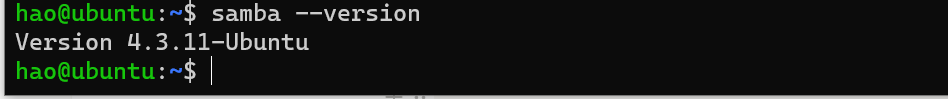
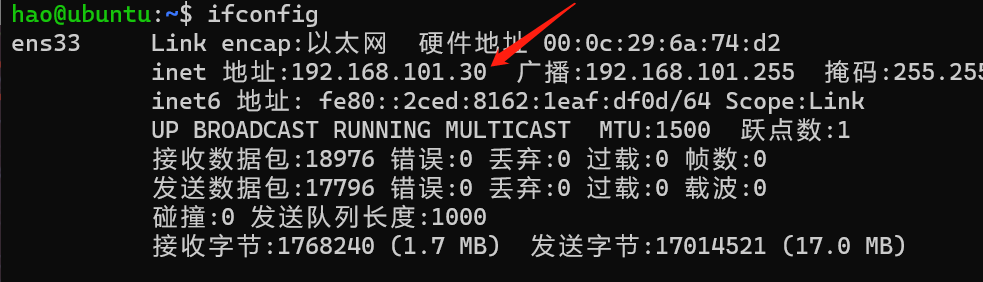
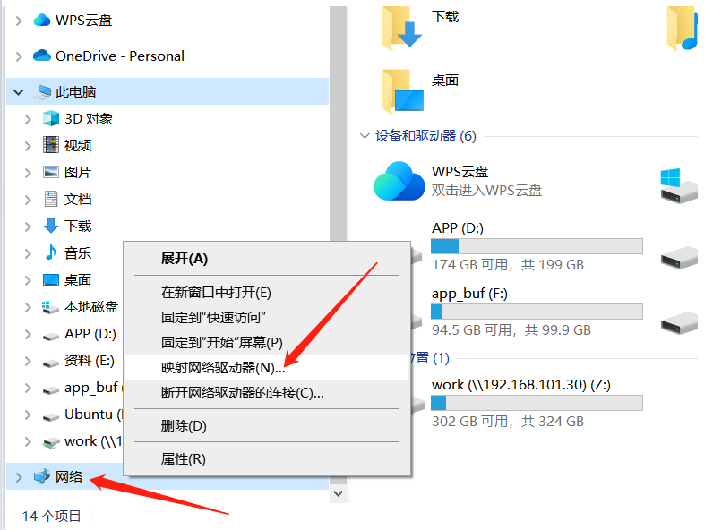
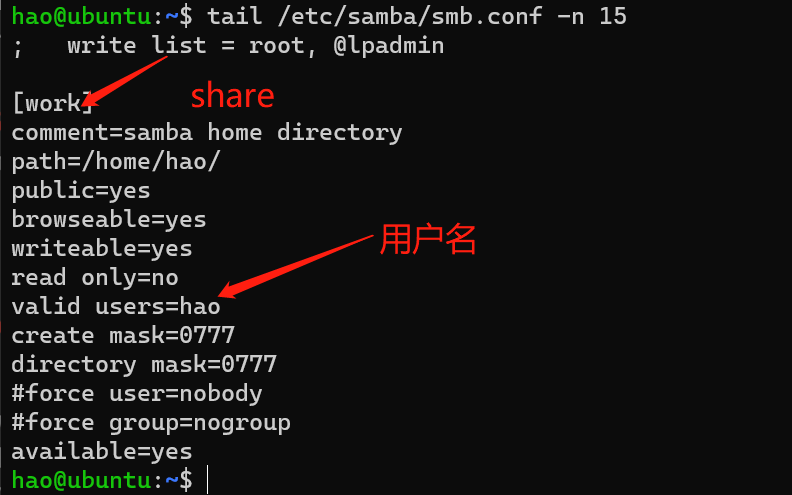
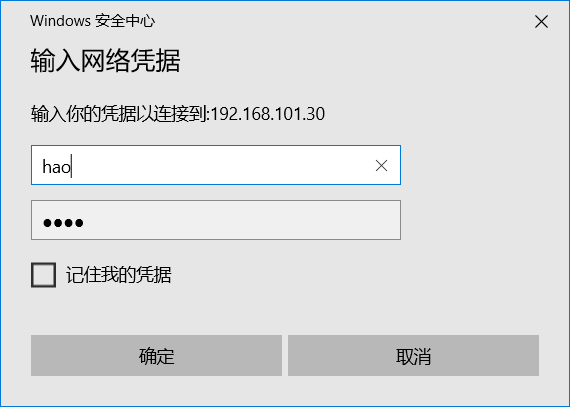
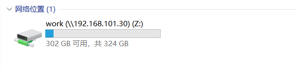

# 1.1、虚拟机端设置

安装samba：

```bash
sudo apt install samba
```

验证samba是否安装成功：

```bash
samba --version
```



备份samba的配置文件

```bash
sudo cp /etc/samba/smb.conf /etc/samba/smb.conf.bak
```

在 **smb.conf** 最后面添加以下内容:

```bash
[work]
comment=samba home directory
path=/home/hao/  #用户目录
public=yes
browseable=yes
writeable=yes
read only=no
valid users=hao  #用户名
create mask=0777
directory mask=0777
#force user=nobody
#force group=nogroup
available=yes
```

设置smb密码:

```bash
sudo smbpasswd -a hao
```

查看一下虚拟机的IP地址：

```bash
ifconfig
```



此时，虚拟机端已经设置完毕，接下来设置主机端~

# 1.2、主机端设置

打开 **文件资源管理器**，在左侧栏右击网络，接着点击 **映射网络驱动器：**



接着会弹出一个窗口，驱动器选择默认的即可，文件夹填入格式为：**\\server\share**

其中server是虚拟机的IP地址，share则为在虚拟机设置时，填入smb.conf文件中第一行的值，如下图：



因此，文件夹项填入：**\\192.168.101.30\work**

紧接着填入用户名与密码，密码是smb的密码：



映射成功，在我的电脑中会看到如下驱动器，此时就可以直接查看和编辑虚拟机中的内容。



此时，就可以在ubuntu系统和windows系统之间互传文件了。
