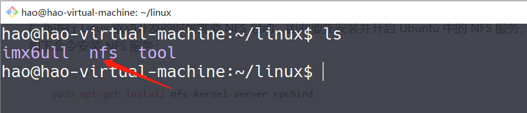

# 1.2、nfs服务器开启

后面进行 Linux 驱动开发的时候需要 NFS 启动，因此要先安装并开启 Ubuntu 中的 NFS 服务，使用如下命令安装 NFS 服务：

```bash
sudo apt-get install nfs-kernel-server rpcbind
```

等待安装完成，安装完成以后在用户根目录下创建一个名为“linux”的文件夹，以后所有的东西都放到这个“linux”文件夹里面，在“linux”文件夹里面新建一个名为“nfs”的文件夹，如图所示:



图中创建的 nfs 文件夹供 nfs 服务器使用，以后我们可以在开发板上通过网络文件系统来访问 nfs 文件夹，要先配置 nfs，使用如下命令打开 nfs 配置文件**/etc/exports**：

```bash
sudo vim /etc/exports
```

打开/etc/exports 以后在后面添加如下所示内容：

```bash
/home/hao/linux/nfs *(rw,sync,no_root_squash)
```

重启 NFS 服务，使用命令如下：

```bash
sudo /etc/init.d/nfs-kernel-server restart
```