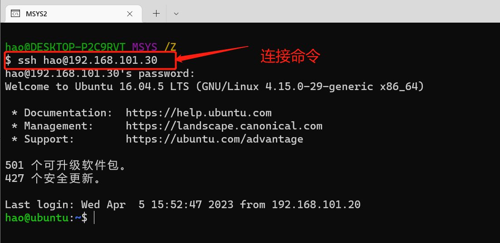

# 1.4、SSH 服务开启

开启 Ubuntu 的 SSH 服务以后我们就可以在 Windwos 下使用终端软件登陆到 Ubuntu，比如
使用 SecureCRT， Ubuntu 下使用如下命令开启 SSH 服务：

```bash
sudo apt-get install openssh-server
```

上述命令安装 ssh 服务， ssh 的配置文件为/etc/ssh/sshd_config，使用默认配置即可。

然后，可以在主机windos上使用终端或者SecureCRT连接虚拟机，我这里使用的是MSYS2连接虚拟机:


