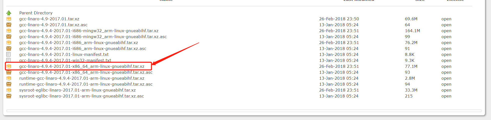
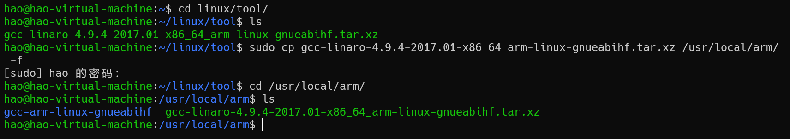
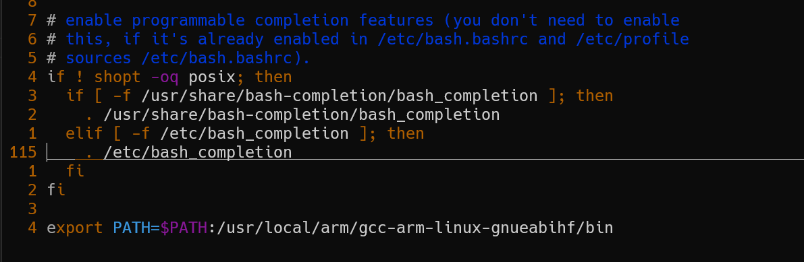
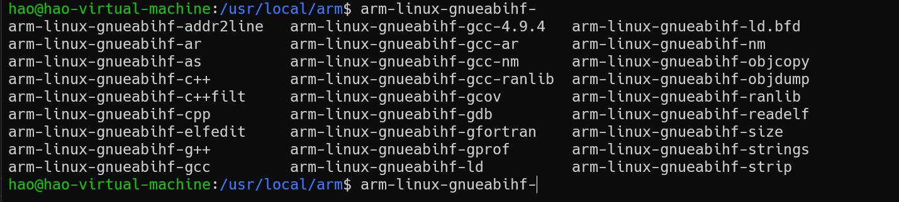

# 1.5 交叉工具链安装

所谓的的交叉工具链就是在PC电脑上编译arm芯片运行的代码。在单片机STM32的开发中使用的交叉编译工具是arm-none-eabi-gcc。而编译imx6ull运行的代码使用的工具是Linaro 出品的交叉编译器， Linaro 是一间非营利性质的开
放源代码软件工程公司， Linaro 开发了很多软件，最著名的就是 Linaro GCC 编译工具链(编译器)，关于 Linaro 详细的介绍可以到 Linaro 官网查阅。Linaro GCC 编译器下载地址如下：
[arm-linux-gnueabihf-gcc](https://releases.linaro.org/components/toolchain/binaries/4.9-2017.01/arm-linux-gnueabihf/)， 打开以后下
载界面如图所示：



在这个 linux 文件夹里面再创建一个名为 **tool** 的文件夹，用来存放一些开发工具。然后通过1.1章配置好的samba服务器将下载好的工具链拷贝到该文件夹下。

在 Ubuntu 中创建目录： **/usr/local/arm**，命令如下：
```bash
sudo mkdir /usr/local/arm
```

创建完成以后将刚刚拷贝的交叉编译器复制到/usr/local/arm 这个目录中，在终端使用命令 **cd** 进入到存放有交叉编译器的目录，比如我前面 将交叉编译器拷贝到了目录 **/home/hao/linux/tool** 中，然后使用如下命令将交叉编译器复制到 **/usr/local/arm** 中：

```bash
sudo cp gcc-linaro-4.9.4-2017.01-x86_64_arm-linux-gnueabihf.tar.xz /usr/local/arm/ -f
```

操作步骤如下：



拷贝完成以后在 **/usr/local/arm** 目录中对交叉编译工具进行解压，解压命令如下：

```bash
sudo tar -vxf gcc-linaro-4.9.4-2017.01-x86_64_arm-linux-gnueabihf.tar.xz
```

等待解压完成，解压完成以后会生成一个名为 **gcc-linaro-4.9.4-2017.01-x86_64_arm-linuxgnueabihf** 的文件夹，这个文件夹里面就是我们的交叉编译工具链。
接下来将该文件夹名字重命名为： **gcc-arm-linux-gnueabihf**。（更改的原因是名字太长了）

修改环境变量，使用 VIM 打开 ~/.bashrc 文件，命令如下：

```bash
sudo vim ~/.bashrc
```

打开 ~/.bashrc 以后，在最后面输入如下所示内容：

> export PATH=$PATH:/usr/local/arm/gcc-arm-linux-gnueabihf



修改好以后就保存退出，执行该命令即可：

```bash
source ~/.bashrc
```

再终端输入 **arm-** 后按下【Tab】查看是否补全：



此时，交叉工具链已经安装完成。
