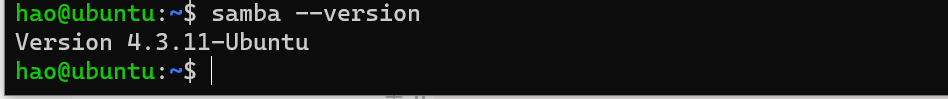
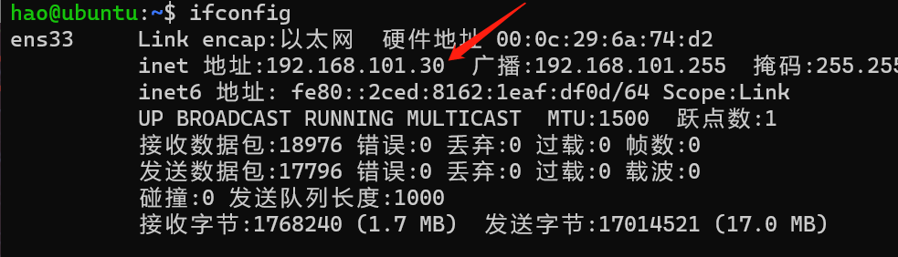
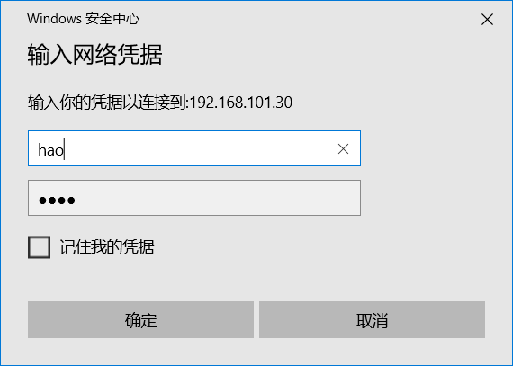
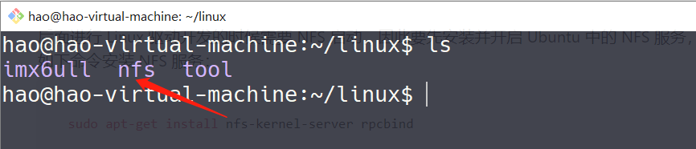

# 环境搭建

## 1.1、虚拟机与主机互传文件

在开发的过程中会频繁的在 Windows 和 Ubuntu 下进行文件传输，比如在 Windwos 下进行
代码编写，然后将编写好的代码拿到 Ubuntu 下进行编译。Windows和Ubuntu下文件互传借助的是windows系统下的 **映射网络驱动器**

### 1.1.1、虚拟机端设置

安装samba：

```bash
sudo apt install samba
```

验证samba是否安装成功：

```bash
samba --version
```



备份samba的配置文件

```bash
sudo cp /etc/samba/smb.conf /etc/samba/smb.conf.bak
```

在 **smb.conf** 最后面添加以下内容:

```bash
[work]
comment=samba home directory
path=/home/hao/  #用户目录
public=yes
browseable=yes
writeable=yes
read only=no
valid users=hao  #用户名
create mask=0777
directory mask=0777
#force user=nobody
#force group=nogroup
available=yes
```

设置smb密码:

```bash
sudo smbpasswd -a hao
```

查看一下虚拟机的IP地址：

```bash
ifconfig
```



此时，虚拟机端已经设置完毕，接下来设置主机端~

### 1.1.2、主机端设置

打开 ****文件资源管理器****，在左侧栏右击网络，接着点击 **映射网络驱动器：**


接着会弹出一个窗口，驱动器选择默认的即可，文件夹填入格式为：**\\server\share**

其中server是虚拟机的IP地址，share则为在虚拟机设置时，填入smb.conf文件中第一行的值，如下图：


因此，文件夹项填入：**\\192.168.101.30\work**

紧接着填入用户名与密码，密码是smb的密码：



映射成功，在我的电脑中会看到如下驱动器，此时就可以直接查看和编辑虚拟机中的内容。


此时，就可以在ubuntu系统和windows系统之间互传文件了。

### 1.2、nfs服务器开启

后面进行 Linux 驱动开发的时候需要 NFS 启动，因此要先安装并开启 Ubuntu 中的 NFS 服务，使用如下命令安装 NFS 服务：

```bash
sudo apt-get install nfs-kernel-server rpcbind
```

等待安装完成，安装完成以后在用户根目录下创建一个名为“linux”的文件夹，以后所有的东西都放到这个“linux”文件夹里面，在“linux”文件夹里面新建一个名为“nfs”的文件夹，如图所示:



图中创建的 nfs 文件夹供 nfs 服务器使用，以后我们可以在开发板上通过网络文件系统来访问 nfs 文件夹，要先配置 nfs，使用如下命令打开 nfs 配置文件**/etc/exports**：

```bash
sudo vim /etc/exports
```

打开/etc/exports 以后在后面添加如下所示内容：

```bash
/home/hao/linux/nfs *(rw,sync,no_root_squash)
```

重启 NFS 服务，使用命令如下：

```bash
sudo /etc/init.d/nfs-kernel-server restart
```

## 1.3、tftp服务器

tftp 命令的作用和 nfs 命令一样，都是用于通过网络下载东西到 DRAM 中，只是 tftp 命令使用的 TFTP 协议， Ubuntu 主机作为 TFTP 服务器。因此需要在 Ubuntu 上搭建 TFTP 服务器，需要安装 tftp-hpa 和 tftpd-hpa，命令如下：

```bash
sudo apt-get install tftp-hpa tftpd-hpa
sudo apt-get install xinetd
```

和 NFS 一样， TFTP 也需要一个文件夹来存放文件，在用户目录下新建一个目录，命令如下：

```bash
sudo mkdir /home/hao/linux/tftpboot
sudo chmod 777 /home/hao/linux/tftpboot
```

这 样 我 就 在 我 的 电 脑 上 创 建 了 一 个 名 为 tftpboot 的 目 录 ( 文 件 夹 ) ， 路 径 为/home/hao/linux/tftpboot。注意！我们要给 tftpboot 文件夹权限，否则的话 uboot 不能从tftpboot 文件夹里面下载文件。

最后配置 tftp，安装完成以后新建文件/etc/xinetd.d/tftp， 如果没有/etc/xinetd.d 目录的话自行创建， 然后在里面输入如下内容：

```bash
server tftp
{
  socket_type = dgram
  protocol = udp
  wait = yes
  user = root
  server = /usr/sbin/in.tftpd
  server_args = -s /home/hao/linux/tftpboot/
  disable = no
  per_source = 11
  cps = 100 2
  flags = IPv4
}
```

完了以后启动 tftp 服务，命令如下：

```bash
sudo service tftpd-hpa start
```

打开/etc/default/tftpd-hpa 文件，将其修改为如下所示内容：

```bash
# /etc/default/tftpd-hpa
TFTP_USERNAME="tftp"
TFTP_DIRECTORY="/home/hao/linux/tftpboot"
TFTP_ADDRESS=":69"
TFTP_OPTIONS="-l -c -s"
```

TFTP_DIRECTORY 就是我们上面创建的 tftp 文件夹目录，以后我们就将所有需要通过TFTP 传输的文件都放到这个文件夹里面，并且要给予这些文件相应的权限。

最后输入如下命令， 重启 tftp 服务器:

```bash
sudo service tftpd-hpa restart
```

## 1.4、SSH 服务开启

开启 Ubuntu 的 SSH 服务以后我们就可以在 Windwos 下使用终端软件登陆到 Ubuntu，比如
使用 SecureCRT， Ubuntu 下使用如下命令开启 SSH 服务：

```bash
sudo apt-get install openssh-server
```

上述命令安装 ssh 服务， ssh 的配置文件为/etc/ssh/sshd_config，使用默认配置即可。

然后，可以在主机windos上使用终端或者SecureCRT连接虚拟机，我这里使用的是MSYS2连接虚拟机:

